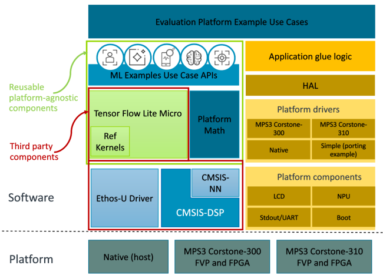

# 알리프 반도체 앙상블 평가 키트 멀티 코어 ML 예

이 프로젝트는 ARM ML 임베디드 평가 키트를 기반으로 합니다. 원래 프로젝트 Readme.md 파일 내용은 아래 섹션 암 ML에 포함된 평가 키트에 있습니다. 이 프로젝트를 앙상블 평가 키트와 함께 사용하는 방법에 대한 자세한 내용은 이 소스 트리의 루트에 있는 "KWS 및 듀얼 M55 코어에 대한 이미지 분류 초안 노트 - 공유" 문서를 참조하십시오.
이것은 초기 베타 참여만을 위한 것임을 유의하십시오.


# Arm® ML 내장 평가 키트

이 저장소는 Arm®Cortex®-M 및 Arm®를 대상으로 하는 ML(Machine Learning) 애플리케이션을 구축하고 배포하기 위한 것입니다
Ethos™-UNPU.
이 소프트웨어를 사용하여 평가를 실행하려면 다음을 사용하는 것이 좋습니다:

- an [MPS3 board](https://developer.arm.com/tools-and-software/development-boards/fpga-prototyping-boards/mps3) with
  [Arm® Corstone-300](https://developer.arm.com/Processors/Corstone-300) or [Arm® Corstone-310](https://developer.arm.com/Processors/Corstone-310) implementations.
  - Arm® Corstone™-300 runs a combination of
  the [Arm® Cortex™-M55 processor](https://www.arm.com/products/silicon-ip-cpu/cortex-m/cortex-m55) and the
  [Arm® Ethos™-U55 NPU](https://www.arm.com/products/silicon-ip-cpu/ethos/ethos-u55).
  - Arm® Corstone™-310 runs a combination of
      the [Arm® Cortex™-M85 processor](https://www.arm.com/products/silicon-ip-cpu/cortex-m/cortex-m85) and the
      [Arm® Ethos™-U55 NPU](https://www.arm.com/products/silicon-ip-cpu/ethos/ethos-u55).

- a [Arm® Corstone™-300 MPS3 based Fixed Virtual Platform (FVP)](https://developer.arm.com/tools-and-software/open-source-software/arm-platforms-software/arm-ecosystem-fvps)
  that offers a choice of the [Arm® Ethos™-U55 NPU](https://www.arm.com/products/silicon-ip-cpu/ethos/ethos-u55)
  or [Arm® Ethos™-U65 NPU](https://www.arm.com/products/silicon-ip-cpu/ethos/ethos-u65) software fast model in combination of
  the new [Arm® Cortex™-M55 processor](https://www.arm.com/products/silicon-ip-cpu/cortex-m/cortex-m55). You can also take advantage of
  [Arm Virtual Hardware](https://www.arm.com/products/development-tools/simulation/virtual-hardware) (AVH) and [run the Fixed Virtual Platform
  in the cloud](./docs/sections/arm_virtual_hardware.md).
  > **NOTE**: While Arm® Corstone™-300 is available as an [Ecosystem FVP](https://developer.arm.com/tools-and-software/open-source-software/arm-platforms-software/arm-ecosystem-fvps)
  > and AVH, Arm® Corstone™-310 is available (for both Arm® Ethos™-U55 and Ethos™-U65 NPUs) only as AVH implementations.

## 포괄적 언어 사용

이 제품은 Arm의 포괄적인 언어 정책에 부합하며, 우리가 아는 한,
를 사용할 때 사용할 수 없는 언어가 없습니다. 걱정되는 것을 발견하면 terms@arm.com 로 이메일을 보내십시오.

## 평가 키트 개요

이 평가 키트의 목적은 사용자가 소프트웨어를 개발하고 Arm® Ethos-UNPU의 성능을 테스트할 수 있도록 하는 것입니다
ML 워크로드용 Arm® Cortex-M CPU. Ethos-UNPU는 특별히 설계된 새로운 종류의 머신 러닝(ML) 프로세서이다
제한된 임베디드 및 IoT 장치에서 ML 계산을 가속화합니다. 제품이 실행되도록 최적화되었습니다
컨볼루션 또는 활성화 함수와 같은 ML 알고리즘에서 일반적으로 사용되는 효율적인 수학적 연산.


## ML 사용 사례

이 평가 키트는 내장된 스택에 ML 애플리케이션을 사용할 준비가 된 상태로 제공함으로써 가치를 추가합니다. 결과적으로, 당신은 할 수 있다
이미 개발된 소프트웨어 사용 사례를 실험하고 Cortex-M CPU 및 Ethos-UNPU용 애플리케이션을 직접 만듭니다.
아래 표에는 사용자가 사용할 수 있는 예제 응용 프로그램과 사용된 모델이 나열되어 있습니다.

|   ML application                     |  Description | Neural Network Model |
| :----------------------------------: | :-----------------------------------------------------: | :----: |
|  [Image classification](./docs/use_cases/img_class.md)        | Recognize the presence of objects in a given image | [Mobilenet V2](https://github.com/ARM-software/ML-zoo/tree/e0aa361b03c738047b9147d1a50e3f2dcb13dbcb/models/image_classification/mobilenet_v2_1.0_224/tflite_int8)   |
|  [Keyword spotting(KWS)](./docs/use_cases/kws.md)             | Recognize the presence of a key word in a recording | [MicroNet](https://github.com/ARM-software/ML-zoo/tree/9f506fe52b39df545f0e6c5ff9223f671bc5ae00/models/keyword_spotting/micronet_medium/tflite_int8) |
|  [Automated Speech Recognition(ASR)](./docs/use_cases/asr.md) | Transcribe words in a recording | [Wav2Letter](https://github.com/ARM-software/ML-zoo/tree/1a92aa08c0de49a7304e0a7f3f59df6f4fd33ac8/models/speech_recognition/wav2letter/tflite_int8) |
|  [KWS and ASR](./docs/use_cases/kws_asr.md) | Utilise Cortex-M and Ethos-U to transcribe words in a recording after a keyword was spotted | [MicroNet](https://github.com/ARM-software/ML-zoo/tree/9f506fe52b39df545f0e6c5ff9223f671bc5ae00/models/keyword_spotting/micronet_medium/tflite_int8)  [Wav2Letter](https://github.com/ARM-software/ML-zoo/tree/1a92aa08c0de49a7304e0a7f3f59df6f4fd33ac8/models/speech_recognition/wav2letter/tflite_int8) |
|  [Anomaly Detection](./docs/use_cases/ad.md)                 | Detecting abnormal behavior based on a sound recording of a machine | [MicroNet](https://github.com/ARM-software/ML-zoo/tree/7c32b097f7d94aae2cd0b98a8ed5a3ba81e66b18/models/anomaly_detection/micronet_medium/tflite_int8/)|
|  [Visual Wake Word](./docs/use_cases/visual_wake_word.md)                 | Recognize if person is present in a given image | [MicroNet](https://github.com/ARM-software/ML-zoo/tree/7dd3b16bb84007daf88be8648983c07f3eb21140/models/visual_wake_words/micronet_vww4/tflite_int8/vww4_128_128_INT8.tflite)|
|  [Noise Reduction](./docs/use_cases/noise_reduction.md)        | Remove noise from audio while keeping speech intact | [RNNoise](https://github.com/ARM-software/ML-zoo/raw/a061600058097a2785d6f1f7785e5a2d2a142955/models/noise_suppression/RNNoise/tflite_int8)   |
|  [Generic inference runner](./docs/use_cases/inference_runner.md) | Code block allowing you to develop your own use case for Ethos-U NPU | Your custom model |
|  [Object detection](./docs/use_cases/object_detection.md)      | Detects and draws face bounding box in a given image | [Yolo Fastest](https://github.com/emza-vs/ModelZoo/blob/master/object_detection/yolo-fastest_192_face_v4.tflite)

상기 사용 사례들은 데이터 전처리 및 후처리를 포함하는 종단 간 ML 흐름을 구현한다. 그들은 너를 허락할 것이다
내장된 소프트웨어 스택을 조사하고 Cortex-M55 CPU 및 Ethos-UNPU에서 실행되는 네트워크의 성능을 평가합니다
추론 주기 수 추정 및 네트워크 실행 결과와 같은 다른 성능 메트릭을 표시함으로써.

## Software and hardware overview

The evaluation kit primarily supports [Arm® Corstone™-300](https://developer.arm.com/ip-products/subsystem/corstone/corstone-300)
and [Arm® Corstone™-310](https://developer.arm.com/ip-products/subsystem/corstone/corstone-310) reference packages as its
primary targets. Arm® Corstone™-300 and Corstone™-310 design implementations are publicly available on [Download FPGA Images](https://developer.arm.com/tools-and-software/development-boards/fpga-prototyping-boards/download-fpga-images) page,
or as a [Fixed Virtual Platform of the MPS3 development board](https://developer.arm.com/tools-and-software/open-source-software/arm-platforms-software/arm-ecosystem-fvps).

The Ethos-U NPU software stack is described [here](https://developer.arm.com/documentation/101888/0500/NPU-software-overview/NPU-software-components?lang=en).

All ML use cases, albeit illustrating a different application, have common code such as initializing the Hardware
Abstraction Layer (HAL). The application common code can be run on native host machine (x86_64 or aarch64) or Arm
Cortex-M architecture thanks to the HAL.
For the ML application-specific part, Google® TensorFlow™ Lite for Microcontrollers inference engine is used to schedule
the neural networks models executions. TensorFlow Lite for Microcontrollers is integrated with the
[Ethos-U NPU driver](https://review.mlplatform.org/plugins/gitiles/ml/ethos-u/ethos-u-core-driver)
and delegates execution of certain operators to the NPU or, if the neural network model operators are not supported on
NPU, to the CPU. If the operator is supported, [CMSIS-NN](https://github.com/ARM-software/CMSIS_5) is used to optimise
CPU workload execution with int8 data type. Else, TensorFlow™ Lite for Microcontrollers' reference kernels are used as
a final fall-back.
Common ML application functions will help you to focus on implementing logic of your custom ML use case: you can modify
only the use case code and leave all other components unchanged. Supplied build system will discover new ML application
code and automatically include it into compilation flow.

A high level overview of the different components in the software, and the platforms supported out-of-the-box, is shown
in the diagram below.



For a more detailed description of the build graph with all major components, see [Building](./docs/documentation.md#building).

### Reusable software

There are source files in the repository that form the core of the Machine Leaning flow for all the use cases. These
are exposed as APIs that the examples can use and even be combined to form chained use cases. The API sources are
designed to be portable across platforms and provide functionality for preprocessing of data, running an inference, and
postprocessing of results. These allow a common flow for all use cases with minor differences in how each of these
blocks are instantiated.

As an independent CMake project, these APIs can be used by or integrated into other projects easily. We also produce
[CMSIS Packs](https://developer.arm.com/tools-and-software/embedded/cmsis/cmsis-packs) with these sources, so they
could be used in all tools/IDEs (for example,
[Arm® Development Studio](https://developer.arm.com/Tools%20and%20Software/Arm%20Development%20Studio) and
[Keil® µVision®](https://www2.keil.com/mdk5/uvision/)) that support the use of CMSIS Packs.

### Getting started

To run an ML application on the Cortex-M and Ethos-U NPU, please, follow these steps:

1. Set up your environment by installing [the required prerequisites](./docs/sections/building.md#Build-prerequisites).
   > **NOTE**: A Docker image built from the `Dockerfile` provided will have all the required packages installed.
2. Generate an optimized neural network model for Ethos-U with a Vela compiler by following instructions [here](./docs/sections/building.md#Add-custom-model).
3. [Configure the build system](./docs/sections/building.md#Build-process).
4. [Compile the project](./docs/sections/building.md#Building-the-configured-project) with a `make` command.
5. If using a FVP, [launch the desired application on the FVP](./docs/sections/deployment.md#Fixed-Virtual-Platform).
If using the FPGA option, load the image on the FPGA and [launch the application](./docs/sections/deployment.md#MPS3-board).

**To get familiar with these steps, you can follow the [quick start guide](docs/quick_start.md).**

> **Note:** The default flow assumes Arm® *Ethos™-U55* NPU usage, configured to use 128 Multiply-Accumulate units
> and is sharing SRAM with the Arm® *Cortex®-M55*.
>
> Ml embedded evaluation kit supports:
>
> |  *Ethos™-U* NPU  | Default MACs/cc | Other MACs/cc supported | Default Memory Mode | Other Memory Modes supported |
> |------------------|-----------------|-------------------------|---------------------|------------------------------|
> |   *Ethos™-U55*   |       128       |      32, 64, 256        |     Shared_Sram     |          Sram_Only           |
> |   *Ethos™-U65*   |       256       |          512            |    Dedicated_Sram   |         Shared_Sram          |
>
> For more information see [Building](./docs/documentation.md#building).

For more details see full documentation:

- [Arm® ML embedded evaluation kit](./docs/documentation.md#arm_ml-embedded-evaluation-kit)
  - [Table of Content](./docs/documentation.md#table-of-content)
  - [Trademarks](./docs/documentation.md#trademarks)
  - **[Prerequisites](./docs/documentation.md#prerequisites)**
    - [Additional reading](./docs/documentation.md#additional-reading)
  - [Repository structure](./docs/documentation.md#repository-structure)
  - [Models and resources](./docs/documentation.md#models-and-resources)
  - [Building](./docs/documentation.md#building)
  - [Deployment](./docs/documentation.md#deployment)
  - [Running code samples applications](./docs/documentation.md#running-code-samples-applications)
  - [Implementing custom ML application](./docs/documentation.md#implementing-custom-ml-application)
  - [Testing and benchmarking](./docs/documentation.md#testing-and-benchmarking)
  - **[Troubleshooting](./docs/documentation.md#troubleshooting)**
  - [Appendix](./docs/documentation.md#appendix)
  - **[FAQ](./docs/documentation.md#faq)**

## Contribution guidelines

Contributions are only accepted under the following conditions:

- The contribution have certified origin and give us your permission. To manage this process we use
  [Developer Certificate of Origin (DCO) V1.1](https://developercertificate.org/).
  To indicate that contributors agree to the terms of the DCO, it's necessary "sign off" the
  contribution by adding a line with name and e-mail address to every git commit message:

  ```log
  Signed-off-by: John Doe <john.doe@example.org>
  ```

  This can be done automatically by adding the `-s` option to your `git commit` command.
  You must use your real name, no pseudonyms or anonymous contributions are accepted.

- You give permission according to the [Apache License 2.0](../LICENSE_APACHE_2.0.txt).

  In each source file, include the following copyright notice:

  ```copyright
  /*
  * SPDX-FileCopyrightText: Copyright <years additions were made to project> <your name>, Arm Limited and/or its affiliates <open-source-office@arm.com>
  * SPDX-License-Identifier: Apache-2.0
  *
  * Licensed under the Apache License, Version 2.0 (the "License");
  * you may not use this file except in compliance with the License.
  * You may obtain a copy of the License at
  *
  *     http://www.apache.org/licenses/LICENSE-2.0
  *
  * Unless required by applicable law or agreed to in writing, software
  * distributed under the License is distributed on an "AS IS" BASIS,
  * WITHOUT WARRANTIES OR CONDITIONS OF ANY KIND, either express or implied.
  * See the License for the specific language governing permissions and
  * limitations under the License.
  */
  ```

### Coding standards and guidelines

This repository follows a set of guidelines, best practices, programming styles and conventions,
see:

- [Coding standards and guidelines](./docs/sections/coding_guidelines.md)
  - [Introduction](./docs/sections/coding_guidelines.md#introduction)
  - [Language version](./docs/sections/coding_guidelines.md#language-version)
  - [File naming](./docs/sections/coding_guidelines.md#file-naming)
  - [File layout](./docs/sections/coding_guidelines.md#file-layout)
  - [Block Management](./docs/sections/coding_guidelines.md#block-management)
  - [Naming Conventions](./docs/sections/coding_guidelines.md#naming-conventions)
    - [C++ language naming conventions](./docs/sections/coding_guidelines.md#c_language-naming-conventions)
    - [C language naming conventions](./docs/sections/coding_guidelines.md#c-language-naming-conventions)
  - [Layout and formatting conventions](./docs/sections/coding_guidelines.md#layout-and-formatting-conventions)
  - [Language usage](./docs/sections/coding_guidelines.md#language-usage)

### Code Reviews

Contributions must go through code review. Code reviews are performed through the
[mlplatform.org Gerrit server](https://review.mlplatform.org). Contributors need to sign up to this
Gerrit server with their GitHub account credentials.
In order to be merged a patch needs to:

- get a "+1 Verified" from the pre-commit job.
- get a "+2 Code-review" from a reviewer, it means the patch has the final approval.

### Testing

Prior to submitting a patch for review please make sure that all build variants works and unit tests pass.
Contributions go through testing at the continuous integration system. All builds, tests and checks must pass before a
contribution gets merged to the main branch.

## Communication

Please, if you want to start public discussion, raise any issues or questions related to this repository, use
[https://discuss.mlplatform.org/c/ml-embedded-evaluation-kit](https://discuss.mlplatform.org/c/ml-embedded-evaluation-kit/)
forum.

## Licenses

The ML Embedded applications samples are provided under the Apache 2.0 license, see [License Apache 2.0](../LICENSE_APACHE_2.0.txt).

Application input data sample files are provided under their original license:

|  | Licence | Provenience |
|---------------|---------|---------|
| [Automatic Speech Recognition Samples](./resources/asr/samples/files.md) | [Creative Commons Attribution 4.0 International Public License](./resources/LICENSE_CC_4.0.txt) | <http://www.openslr.org/12/> |
| [Image Classification Samples](./resources/img_class/samples/files.md) | [Creative Commons Attribution 1.0](./resources/LICENSE_CC_1.0.txt) | <https://www.pexels.com> |
| [Keyword Spotting Samples](./resources/kws/samples/files.md) | [Creative Commons Attribution 4.0 International Public License](./resources/LICENSE_CC_4.0.txt) | <http://download.tensorflow.org/data/speech_commands_v0.02.tar.gz> |
| [Keyword Spotting and Automatic Speech Recognition Samples](./resources/kws_asr/samples/files.md) | [Creative Commons Attribution 4.0 International Public License](./resources/LICENSE_CC_4.0.txt) | <http://download.tensorflow.org/data/speech_commands_v0.02.tar.gz> |
| [Visual Wake Word Samples](./resources/vww/samples/files.md) | [Creative Commons Attribution 1.0](./resources/LICENSE_CC_1.0.txt) | <https://www.pexels.com> |
| [Noise Reduction Samples](./resources/noise_reduction/samples/files.md) | [Creative Commons Attribution 4.0 International Public License](./resources/LICENSE_CC_4.0.txt) | <https://datashare.ed.ac.uk/handle/10283/2791/> |
| [Object Detection Samples](./resources/object_detection/samples/files.md) | [Creative Commons Attribution 1.0](./resources/LICENSE_CC_1.0.txt) | <https://www.pexels.com> |
