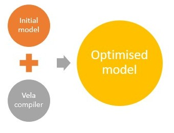
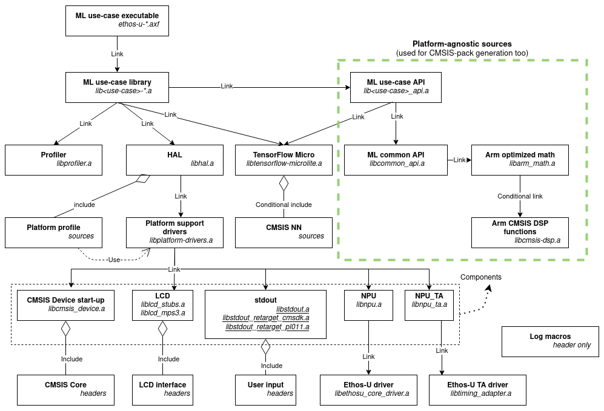

# Arm® ML embedded evaluation kit

- [Arm® ML embedded evaluation kit](./documentation.md#arm_ml-embedded-evaluation-kit)
  - [Trademarks](./documentation.md#trademarks)
  - [Prerequisites](./documentation.md#prerequisites)
    - [Additional reading](./documentation.md#additional-reading)
  - [Repository structure](./documentation.md#repository-structure)
  - [Models and resources](./documentation.md#models-and-resources)
  - [Building](./documentation.md#building)
  - [Deployment](./documentation.md#deployment)
  - [Implementing custom ML application](./documentation.md#implementing-custom-ml-application)
  - [Testing and benchmarking](./documentation.md#testing-and-benchmarking)
  - [Memory Considerations](./documentation.md#memory-considerations)
  - [Troubleshooting](./documentation.md#troubleshooting)
  - [Appendix](./documentation.md#appendix)
  - [FAQ](./documentation.md#faq)

## Trademarks

- Arm® and Cortex® are registered trademarks of Arm® Limited (or its subsidiaries) in the US and/or elsewhere.
- Arm® and Ethos™ are registered trademarks or trademarks of Arm® Limited (or its subsidiaries) in the US and/or
  elsewhere.
- Arm® and Corstone™ are registered trademarks or trademarks of Arm® Limited (or its subsidiaries) in the US and/or
  elsewhere.
- Arm®, Keil® and µVision® are registered trademarks of Arm Limited (or its subsidiaries) in the US and/or elsewhere.
- Microsoft® and Windows® are proprietary registered trademarks of Microsoft and its group of companies.
- TensorFlow™, the TensorFlow logo, and any related marks are trademarks of Google Inc.

## Prerequisites

설치 프로세스를 시작하기 전에 다음 사항이 있는지 확인하십시오:

- Linux x86_64 기반 시스템입니다. Microsoft® Windows®를 사용하는 경우에는 WSL(Windows Subsystem for Linux)이 좋습니다.
  > **참고:** 현재 Microsoft® Windows®는 빌드 환경으로 지원되지 않습니다.

- 다음 도구 체인 중 하나 이상:
  - GNU Arm Embedded 툴 체인(버전 10.2.1 이상) -
  [GNU 암 임베디드 툴체인 다운로드] (https://developer.arm.com/tools-and-software/open-source-software/developer-tools/gnu-toolchain/gnu-rm/downloads)
  - 유효한 라이센스가 있는 Arm Compiler(버전 6.16 이상) -
  [Arm Compiler 다운로드 페이지](https://developer.arm.com/tools-and-software/embedded/arm-compiler/downloads)

- Arm® MPS3 FPGA 프로토타입 보드 및 FPGA 평가를 위한 구성 요소 또는 '고정 가상 플랫폼' 바이너리:
  - Arm® Corstone™-300('AN552') 또는 Corstone™-310 참조 패키지('AN555')가 탑재된 MPS3 보드. 봐
    <https://developer.arm.com/downloads/-/download-fpga-images >. 너
    기계와 MPS3 보드 사이에 USB 연결이 있어야 합니다. - UART 메뉴 및 배포용
    어플.
  - 'Arm® Corstone™-300' 기반의 MPS3 FVP는 다음 사이트에서 사용할 수 있습니다:
    <https://developer.arm.com/tools-and-software/open-source-software/arm-platforms-software/arm-ecosystem-fvps >.
  - Arm® Corstone™-310 기반의 FVP는 Ar 아래에서 사용할 수 있습니다m® 가상 하드웨어: <https://www.arm.com/products/development-tools/simulation/virtual-hardware >

> **참고:**: MPS3 FPGA 보드에 사용할 수 있는 Arm® Corstone™-300 구현은 두 가지입니다. 응용 프로그램
>는 'AN547'과 'AN552'에 주목한다. 우리는 최신 애플리케이션 노트인 'AN552'와 정렬되어 있다. 그러나 애플리케이션이 구축되었습니다
> for MPS3 대상은 두 FPGA 패키지 모두에서 작동해야 합니다.
### Additional reading

이 문서에는 Arm® Ethos™-U55 및 Arm® Ethos™-U65 제품에 고유한 정보가 포함되어 있습니다. 다음 문서를 참조하십시오
추가 정보:

- ML platform overview: <https://mlplatform.org/>

- Arm® ML processors technical overview: <https://developer.arm.com/ip-products/processors/machine-learning>

- Arm® `Cortex-M55`® processor: <https://www.arm.com/products/silicon-ip-cpu/cortex-m/cortex-m55>

- Arm® `Cortex-M85`® processor: <https://www.arm.com/products/silicon-ip-cpu/cortex-m/cortex-m85>

- ML processor, also referred to as a Neural Processing Unit (NPU) - Arm® `Ethos™-U55`:
    <https://www.arm.com/products/silicon-ip-cpu/ethos/ethos-u55>

- ML processor, also referred to as a Neural Processing Unit (NPU) - Arm® `Ethos™-U65`:
    <https://www.arm.com/products/silicon-ip-cpu/ethos/ethos-u65>

- Arm® MPS3 FPGA Prototyping Board:
    <https://developer.arm.com/tools-and-software/development-boards/fpga-prototyping-boards/mps3>

- Arm® Fixed Virtual Platforms: <https://developer.arm.com/Tools%20and%20Software/Fixed%20Virtual%20Platforms>

- Arm® Virtual Hardware: <https://www.arm.com/products/development-tools/simulation/virtual-hardware>

- Arm® ML-Zoo: <https://github.com/ARM-software/ML-zoo/>

- Arm® Ethos-U NPU™ software: <https://review.mlplatform.org/plugins/gitiles/ml/ethos-u/ethos-u>

To access Arm documentation online, please visit: <http://developer.arm.com>

## Repository structure

The repository has the following structure:

```tree
├── CMakeLists.txt
├── dependencies
├── docs
├── model_conditioning_examples
├── resources
├── /resources_downloaded/
├── scripts
│     ├── cmake
│     │    ├── platforms
│     │    │      ├── mps3
│     │    │      ├── native
│     │    │      └── simple_platform
│     │    └── ...
│     └── ...
├── source
│     ├── application
│     │    ├── api
│     │    │    ├── common
│     │    │    └── use_case
│     │    └── main
│     ├── hal
│     │    ├── include
│     │    └── source
│     ├── log
│     │    └── include
│     ├── math
│     │    └── include
│     ├── profiler
│     │    └── include
│     use_case
│       └── <usecase_name>
│           ├── include
│           ├── src
│           └── usecase.cmake
└── tests
```

What these folders contain:

- '의존성': 이 프로젝트의 모든 타사 종속성입니다. 이들은 'git submodule' 또는 'git submodule'에 의해 채워집니다
    필요한 계층의 패키지를 다운로드합니다. download_dependencies.py'를 참조하십시오.

- '''debug''': 이 리포지토리에 대한 자세한 문서입니다.

- 'model_conditioning_exples': 텐서플로우에서 사용할 수 있는 몇 가지 방법을 보여주는 짧은 예제 스크립트
    Arm Ethos NPU에 배치하기 위해 모델을 조정합니다.

- 리소스: 입력 데이터, 레이블 파일 등의 ML 사용 사례 응용 프로그램 리소스가 포함되어 있습니다.

- 'set_up_default_details': 'set_up_default_details'에 의해 생성됩니다.py', ML 사용 사례를 위한 다운로드된 리소스 포함
    모델, 테스트 데이터 등의 응용 프로그램. 또한 필요한 모든 것을 갖춘 Python 가상 환경을 포함합니다
    설치된 패키지.

- '''debug''': 빌드 및 소스 생성 스크립트.

- 'scripts/cmake/platforms': 플랫폼 빌드 구성 스크립트 'build_configuration.cmake'가 여기에 있습니다.
   이러한 스크립트는 플랫폼 소스를 애플리케이션 빌드 스트림에 추가하고 있습니다. 이 스크립트에는 두 가지 기능이 있습니다:
  - 'set_platform_global_module' - 플랫폼 소스 위치 및 기타 빌드 옵션을 설정합니다.
  - 'platform_custom_post_build' - 특정 포스트 빌드 단계를 실행합니다. 예를 들어 MPS3 보드 관련 스크립트가 추가됩니다
                                    보드 고유의 'sublish'txt' 파일 생성 및 calls bin generation 명령.
                                    네이티브 프로파일 관련 스크립트는 단위 테스트를 컴파일합니다.

- source: 플랫폼 및 ML 애플리케이션의 C/C 소스.

  *application* 하위 폴더의 내용은 다음과 같습니다:

  - '응용 프로그램': 응용프로그램의 *core*를 구성하는 모든 소스. 소스의 '사용 사례' 부분은 다음과 같이 결정됩니다
    다음과 같은 소스 자체:
    - 'main': 시작하기 전에 설정할 수 있도록 주요 기능과 플랫폼 초기화 로직에 대한 호출을 포함합니다
      메인 루프. 또한 모든 사용 사례 구현에 공통적인 소스를 포함합니다.

    - 'api': 모든 사용 사례가 사용할 수 있는 **플랫폼에 구애받지 않는 ** API가 포함되어 있습니다. TensorFlow에만 의존합니다
      '수학' 모듈에 의해 드러난 라이트 마이크로와 수학 기능. 다음으로 세분화된다:

      - 'common': API의 공통 부분. 이것은 신경망 모델 초기화와 같은 일반 코드로 구성된다,
        추론을 실행하고 이미지 및 오디오 사용 사례에 사용되는 몇 가지 일반적인 논리를 실행합니다.

      - 'use_case': 여기에는 각 개별 사용 사례에 대한 "모델" 및 "프로세싱" API가 포함되어 있습니다. 예를 들어, KWS 사용 사례
        일반적인 KWS 신경망 모델을 위한 클래스를 포함하고 있으며 "프로세싱" API는 사용자가 더 쉽게 구동할 수 있는 방법을 제공합니다
        MFCC 계산.

     > **참고:** 여기 있는 API는 또한 이 저장소에서 CMSIS 팩을 내보내는 데 사용되므로 반드시 해야 합니다
     > 여기서 소스는 HAL 구성 요소에 의존하지 않거나 플랫폼에 의존하는 로직을 구동하지 않습니다. 만약 당신이 기대하고 있다면
     > 응용 프로그램 레벨 로직을 위해 이 저장소의 구성 요소를 재사용합니다. 이 디렉터리가 가장 중요한 후보입니다.

  - hal: 하드웨어 추상화 계층(HAL) 소스를 포함하여 하드웨어에 액세스하기 위한 플랫폼에 구애받지 않는 API를 제공합니다
    플랫폼별 기능.

    > **참고:** Arm Ethos-UNPU 소프트웨어 프레임워크와 관련된 공통 코드는 *hal/components* 하위 폴더에 있습니다.

  - 'log': 로그 레벨을 관리하는 모든 코드 로깅 매크로에 공통입니다.

  - 'math': ML 파이프라인에서 사용할 산술 함수. 그들 중 일부는 암 CPU에서 최적화된 실행을 위해 CMSIS DSP를 사용한다.
     정적 라이브러리 'libarm_math.a'에 내장된 별도의 CMake 프로젝트이다.

  - 'profiler': 프로파일링 유틸리티 코드로 주기 수와 PMU 정보를 수집하고 출력한다.
    정적 라이브러리 'libprofiler.a'에 내장된 별도의 씨메이크 프로젝트다.

  - 'use_case': ML 사용 사례별 로직을 포함합니다. 별도의 하위 폴더로 저장되어 다음을 분리하는 데 도움이 됩니다
    ML별 응용 프로그램 로직. '응용 프로그램'이 논리에 필요한 설정을 수행한다는 가정하에
    달려. 또한 새로운 사용 사례 블록을 더 쉽게 추가할 수 있습니다.

  - '''debug''': 사용 사례 응용 프로그램에 대한 x86 테스트를 포함합니다.

The HAL has the following structure:

```tree
hal
├── CMakeLists.txt
├── include
│     ├── hal.h
│     ├── hal_lcd.h
│     └── hal_pmu.h
└── source
    ├── components
    │     ├── cmsis_device
    │     ├── lcd
    │     ├── npu
    │     ├── npu_ta
    │     ├── platform_pmu
    │     └── stdout
    ├── hal.c
    ├── hal_pmu.c
    └── platform
        ├── mps3
        ├── native
        └── simple
```

HAL is built as a separate project into a static library `libhal.a`. It is linked with use-case executable.

What these folders contain:

- The folders `include` and `source/hal.c` contain the HAL top-level platform API and data acquisition, data presentation, and
  timer interfaces.
    > **Note:** the files here and lower in the hierarchy have been written in C and this layer is a clean C/ + boundary
    > in the sources.

- `source/components` directory contains API and implementations for different modules that can be reused for different
  platforms. These contain common functions for Arm Ethos-U NPU initialization, timing adapter block helpers and others.
  Each component produces a static library that could potentially be linked into the platform library to enable
  usage of corresponding modules from the platform sources. For example, most of the use-cases use NPU and
  timing adapter initialization. Similarly, the LCD component provides a standard LCD API used by HAL and propagated
  up the hierarchy. Two static library targets are provided for the LCD module - one with stubbed implementation and the
  other which can drive the LCD on an Arm MPS3 target. If you want to run default ML use-cases on a custom platform, you
  could re-use existing code from this directory provided it is compatible with your platform.

- `source/components/cmsis_device` has a common startup code for Cortex-M based systems. The package defines interrupt vector table and
    handlers. Reset handler - starting point of our application - is also defined here. This entry point is responsible
    for the set-up before calling the user defined "main" function in the higher-level `application` logic.
    It is a separate CMake project that is built into a static library `libcmsis_device.a`. It depends on a CMSIS repo
    through `CMSIS_SRC_PATH` variable.
    The static library is used by platform code.

- `source/platform/mps3`\
  `source/platform/simple`:
  These folders contain platform specific declaration and defines, such as, platform initialisation code, peripheral
  memory map, system registers, system specific timer implementation and other.
  Platform is built from selected components and configured cmsis device. It is a separate CMake project, and is
  built into a static library `libplatform-drivers.a`. It is linked into HAL library.

## Models and resources

The models used in the use-cases implemented in this project can be downloaded from:

- [Arm ML-Zoo](https://github.com/ARM-software/ML-zoo) ( [Apache 2.0 License](https://github.com/ARM-software/ML-zoo/blob/master/LICENSE) )

  - [Mobilenet V2](https://github.com/ARM-software/ML-zoo/tree/e0aa361b03c738047b9147d1a50e3f2dcb13dbcb/models/image_classification/mobilenet_v2_1.0_224/tflite_int8)
  - [MicroNet for Keyword Spotting](https://github.com/ARM-software/ML-zoo/tree/9f506fe52b39df545f0e6c5ff9223f671bc5ae00/models/keyword_spotting/micronet_medium/tflite_int8)
  - [Wav2Letter](https://github.com/ARM-software/ML-zoo/tree/1a92aa08c0de49a7304e0a7f3f59df6f4fd33ac8/models/speech_recognition/wav2letter/tflite_pruned_int8)
  - [MicroNet for Anomaly Detection](https://github.com/ARM-software/ML-zoo/tree/7c32b097f7d94aae2cd0b98a8ed5a3ba81e66b18/models/anomaly_detection/micronet_medium/tflite_int8)
  - [MicroNet for Visual Wake Word](https://github.com/ARM-software/ML-zoo/raw/7dd3b16bb84007daf88be8648983c07f3eb21140/models/visual_wake_words/micronet_vww4/tflite_int8/vww4_128_128_INT8.tflite)
  - [RNNoise](https://github.com/ARM-software/ML-zoo/raw/a061600058097a2785d6f1f7785e5a2d2a142955/models/noise_suppression/RNNoise/tflite_int8/rnnoise_INT8.tflite)

- [Emza Visual Sense ModelZoo](https://github.com/emza-vs/ModelZoo) ( [Apache 2.0 License](https://github.com/emza-vs/ModelZoo/blob/v1.0/LICENSE) )

  - [YOLO Fastest](https://github.com/emza-vs/ModelZoo/blob/v1.0/object_detection/yolo-fastest_192_face_v4.tflite)

When using *Ethos-U* NPU backend, Vela compiler optimizes the the NN model. However, if not and it is supported by
TensorFlow Lite Micro, then it falls back on the CPU and execute.



The Vela compiler is a tool that can optimize a neural network model into a version that run on an embedded system
containing the *Ethos-U* NPU.

The optimized model contains custom operators for sub-graphs of the model that the *Ethos-U* NPU can accelerate. The
remaining layers that cannot be accelerated, are left unchanged, and are run on the CPU using optimized, `CMSIS-NN`, or
reference kernels provided by the inference engine.

For detailed information, see: [Optimize model with Vela compiler](./sections/building.md#Optimize-custom-model-with-Vela-compiler).

## Building

This section explains the build process and intra-project dependencies, describes how to build the code sample
applications from sources and includes illustrating the build options and the process.

The following graph of source modules aims to explain better intra-project code and build execution dependencies.


The project can be built for MPS3 FPGA and FVP emulating MPS3. Using default values for configuration parameters builds
executable models that support the *Ethos-U* NPU.

For further information, please see:

- [Building the ML embedded code sample applications from sources](./sections/building.md#building-the-ml-embedded-code-sample-applications-from-sources)
  - [Build prerequisites](./sections/building.md#build-prerequisites)
  - [Build options](./sections/building.md#build-options)
  - [Build process](./sections/building.md#build-process)
    - [Preparing build environment](./sections/building.md#preparing-build-environment)
      - [Fetching submodules](./sections/building.md#fetching-submodules)
      - [Fetching resource files](./sections/building.md#fetching-resource-files)
    - [Create a build directory](./sections/building.md#create-a-build-directory)
    - [Configuring the build for MPS3 SSE-300](./sections/building.md#configuring-the-build-for-mps3-sse_300)
      - [Using GNU Arm embedded toolchain](./sections/building.md#using-gnu-arm-embedded-toolchain)
      - [Using Arm Compiler](./sections/building.md#using-arm-compiler)
      - [Generating project for Arm Development Studio](./sections/building.md#generating-project-for-arm-development-studio)
      - [Configuring with custom TPIP dependencies](./sections/building.md#configuring-with-custom-tpip-dependencies)
    - [Configuring native unit-test build](./sections/building.md#configuring-native-unit_test-build)
    - [Configuring the build for simple-platform](./sections/building.md#configuring-the-build-for-simple_platform)
    - [Building the configured project](./sections/building.md#building-the-configured-project)
  - [Building timing adapter with custom options](./sections/building.md#building-timing-adapter-with-custom-options)
  - [Add custom inputs](./sections/building.md#add-custom-inputs)
  - [Add custom model](./sections/building.md#add-custom-model)
  - [Optimize custom model with Vela compiler](./sections/building.md#optimize-custom-model-with-vela-compiler)
  - [Building for different Ethos-U NPU variants](./sections/building.md#building-for-different-ethos_u-npu-variants)
  - [Automatic file generation](./sections/building.md#automatic-file-generation)

## Deployment

This section describes how to deploy the code sample applications on the Fixed Virtual Platform (FVP) or the MPS3 board.

For further information, please see:

- [Deployment](./sections/deployment.md#deployment)
  - [Fixed Virtual Platform](./sections/deployment.md#fixed-virtual-platform)
    - [Setting up the MPS3 Corstone-300 FVP](./sections/deployment.md#setting-up-the-mps3-arm-corstone_300-fvp)
    - [Deploying on an FVP emulating MPS3](./sections/deployment.md#deploying-on-an-fvp-emulating-mps3)
  - [MPS3 board](./sections/deployment.md#mps3-board)
    - [Deployment on MPS3 board](./sections/deployment.md#deployment-on-mps3-board)

## Implementing custom ML application

This section describes how to implement a custom Machine Learning application running on a platform supported by the
repository, either an FVP or an MPS3 board.

Both the *Cortex-M55* CPU and *Ethos-U* NPU Code Samples software project offers a way to incorporate extra use-case
code into the existing infrastructure. It also provides a build system that automatically picks up added functionality
and produces corresponding executable for each use-case.

For further information, please see:

- [Implementing custom ML application](./sections/customizing.md#implementing-custom-ml-application)
  - [Software project description](./sections/customizing.md#software-project-description)
  - [Hardware Abstraction Layer API](./sections/customizing.md#hardware-abstraction-layer-api)
  - [Main loop function](./sections/customizing.md#main-loop-function)
  - [Application context](./sections/customizing.md#application-context)
  - [Profiler](./sections/customizing.md#profiler)
  - [NN Model API](./sections/customizing.md#nn-model-api)
  - [Adding custom ML use-case](./sections/customizing.md#adding-custom-ml-use_case)
  - [Implementing main loop](./sections/customizing.md#implementing-main-loop)
  - [Implementing custom NN model](./sections/customizing.md#implementing-custom-nn-model)
  - [Executing inference](./sections/customizing.md#executing-inference)
  - [Printing to console](./sections/customizing.md#printing-to-console)
  - [Reading user input from console](./sections/customizing.md#reading-user-input-from-console)
  - [Output to MPS3 LCD](./sections/customizing.md#output-to-mps3-lcd)
  - [Building custom use-case](./sections/customizing.md#building-custom-use_case)
  - [Adding custom platform support](./sections/customizing.md#adding-custom-platform-support)

## Testing and benchmarking

Please refer to: [Testing and benchmarking](./sections/testing_benchmarking.md#testing-and-benchmarking).

## Memory Considerations

Please refer to:

- [Memory considerations](./sections/memory_considerations.md#memory-considerations)
  - [Understanding memory usage from Vela output](./sections/memory_considerations.md#understanding-memory-usage-from-vela-output)
    - [Total SRAM used](./sections/memory_considerations.md#total-sram-used)
    - [Total Off-chip Flash used](./sections/memory_considerations.md#total-off_chip-flash-used)
  - [Memory mode configurations](./sections/memory_considerations.md#memory-mode-configurations)
  - [Tensor arena and neural network model memory placement](./sections/memory_considerations.md#tensor-arena-and-neural-network-model-memory-placement)
  - [Memory usage for ML use-cases](./sections/memory_considerations.md#memory-usage-for-ml-use_cases)
  - [Memory constraints](./sections/memory_considerations.md#memory-constraints)

## Troubleshooting

For further information, please see:

- [Troubleshooting](./sections/troubleshooting.md#troubleshooting)
  - [Inference results are incorrect for my custom files](./sections/troubleshooting.md#inference-results-are-incorrect-for-my-custom-files)
  - [The application does not work with my custom model](./sections/troubleshooting.md#the-application-does-not-work-with-my-custom-model)
  - [NPU configuration mismatch error when running inference](./sections/troubleshooting.md#npu-configuration-mismatch-error-when-running-inference)
  - [Errors when cloning the repository](./sections/troubleshooting.md#errors-when-cloning-the-repository)
  - [Problem installing Vela](./sections/troubleshooting.md#problem-installing-vela)
  - [No matching distribution found for ethos-u-vela==3.3.0](./sections/troubleshooting.md#no-matching-distribution-found-for-ethos_u_vela)
    - [How to update Python3 package to newer version](./sections/troubleshooting.md#how-to-update-python3-package-to-newer-version)

## Appendix

Please refer to:

- [Appendix](./sections/appendix.md#appendix)
  - [Cortex-M55 Memory map overview](./sections/appendix.md#arm_cortex_m55-memory-map-overview-for-corstone_300-reference-design)

## FAQ

Please refer to: [FAQ](./sections/faq.md#faq)
